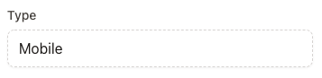
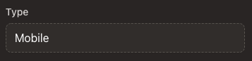
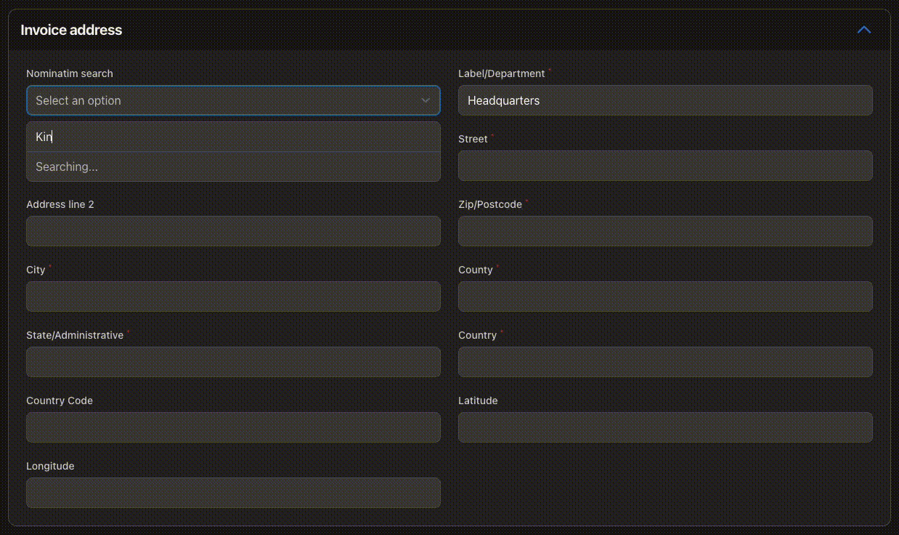

# Very opinionated Filament extras
In this repository I will add helpers, blade components, fields and columns that I use in my Filament projects.
Regard them as a templates for your own apps...

If they get merged into the main Filament repo, they will be removed here!, but then you'll find them there ;)

Might be best to fork this repo so you're in control of changes, or install the dev branch. It is not my plan to keep release versions.

## Documentation
There won't be much documentation written, this repository will grow as I add items.
Hopefully the source code contains enough hints to use the components.
If not, please post a question in the discussions tab.

## Requirements
- PHP 8.0|8.1+
- Laravel v9.0+
- Livewire v2.0+
- Filament v2.0+

## Installation
```bash
composer require tanthammar/filament-extras
```

## Screenshots
Disabled field

 

AddressSection



## Macros
See `FilamentExtrasServiceProvider`

```bash
saveIfSelfFilled
saveIfSelfBlank
saveIfSelfValue
saveIfSelfNoValue
saveAs
ignored
requiredIfBlank
requiredIfFilled
requiredIfChecked
requiredIfUnChecked
nullableIfBlank
nullableIfFilled
nullableIfChecked
nullableIfUnChecked
hiddenIfBlank
hiddenIfFilled
hiddenIfChecked
hiddenIfUnChecked
visibleIfBlank
visibleIfFilled
visibleIfChecked
visibleIfUnChecked
ucwords
ucfirst
smallcaps
uppercase
``` 

## Blade components
See resources/views/components

Example
```html
<x-filament-extras::form submit="submitMethodName" label="Form heading" description="Very nice form component" button="Save">
    {{ $this->form }}
    <x-slot name="buttons"> <!-- optional slot inlined with the save button --> </x-slot>
</x-filament-extras::form>
```

## Form Fields
See src/Forms

```php
AddressSection::make(string $jsonColumnName = 'address', string $label = 'Address'); //Address lookup using free OSM service. Consists of AddressSearch + AddressFields
AddressSearch::make(string $jsonColumnName = 'address'); //Address search field only, if you want to add your own fields for the Address lookup
AddressFields::make(?string $jsonColumnName = null); //The fields that Address search tries to fill 

Uuid::make(mixed $hiddenOn, string $column = 'uuid');
BusinessName::make(string $column = 'name');
FirstName::make(string $column = 'first_name');
LastName::make(string $column = 'last_name');
Email::make(string $column = 'email', bool $unique = true);

Disabled::make(string $name); //Field that carries and displays a value but cannot be edited in frontend, represented with a dashed border
HiddenOrSelect::make(bool $condition, string $column, string $label, string|array $rule, array $options );
HiddenOrText::make(bool $condition, string $column, string $label, string|array $rule);

JetstreamAuthorSection::make();

LandLine::make(string $column = 'phone', null|int $default = 460, string $label = 'fields.phone');//validates international landline numbers
Mobile::make(string $column = 'mobile', null|int $default = 460, string $label = 'fields.mobile'); //validates international mobile numbers
Phone::make(string $column = 'phone', null|int $default = 460, string $label = 'fields.phone'); //validates international phone numbers (disregards phone number type)

SpatieSlug::make(mixed $hiddenOn, string $column = 'slug');
TranslatableDescription::make(string $column, string $autoFillFrom, string $label);

PasswordInput::current();
PasswordInput::create();
PasswordInput::confirmation();
```

## Table Columns
See src/Tables
```php
DTOColumn::make(string $column, string $attribute); //If you cast your json column into DTO's. Retrieved as $column?->attribute ?? ''
JsonColumn::make(string $column, string $dotNotation); //Cast your json column into 'array'. Retreived as data_get($column, $dotNotation, '')
PhoneColumn::make(string $column); //Auto-format international phone numbers (slow!, better to format when you save your value)
```


